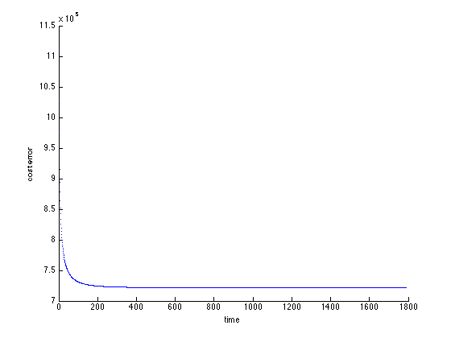
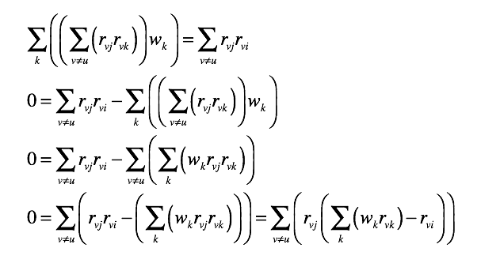
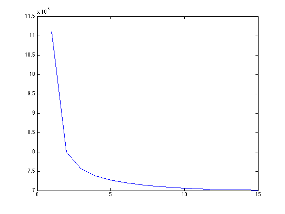

数据挖掘期末项目 - 推荐系统报告
=====================
小组成员：李志浩（1152691），卢佚仁（1152723），杨明（1152725）

## Step.1 Baseline Estimator
#### 方法
这一部分的实现主要参照*Koren08'* 2.1节关于Baseline esimates的描述。考虑到每个用户习惯性评价的偏差和物品统计意义上被评价的偏差，得到了baseline的算法。通过尝试使用与用户和物品相关的系数作为偏差来拟合真实数据，从而形成用户对某商品评价的基础。

选取参数lambda1为0.2以避免过拟合。在对bu和bi的求解上采用最速下降法，取调节系数eta为0.001。在参数eta的选取上，我们迭代了2^-10到2^-1，通过观察误差的下降趋势，当eta取得0.001时开始的坡度较陡，然后趋于收敛。故eta是一个较好的折中。

为了避免由于参数选取不当引起最速下降产生震荡，我们在运算的过程当中绘制了趋势图，如下图。

#### 结果
利用本算法在测试集上获得的RMSE为0.9231，低于Global Average 1.1607,在MovieLens数据集当中优于文章当中Netfix原有的0.9514。但由于两数据集不同，故本数据无可比性。

## Step.2 Neighbourhood Estimator
### 2.1 Item-based Similarity
#### 方法

这一部分的实现主要参照 *Koren08'* 2.2节关于Neighborhood models的描述，参数lambda2采取作者建议为100。在pearson相关系数的计算上，取item i与j的公有用户，即对i和j电影均有打分的用户，作为比较集。排除只看过其中一部或者均未看过的用户的干扰，使得到的相似度更接近事实。

然后再进一步考虑公共用户的个数对数据可依赖程度的影响，最终得到相似度。运用公式（2）

#### 结果
利用本算法在测试集上获得的RMSE为0.8868，低于Baseline estimates的0.9231。

### 2.2 Linear Regression
#### 方法

这一部分的实现主要参照 *BellKorICDM07* 第四节关于Neighborhood Relationship Model的描述。本部分如同一般的协同过滤，通过计算相似的物品来计算推荐结果。

在本部分我们取20个最相似的邻居，通过类似梯度下降发/感知机的方法对于结果进行估计。在论文当中提供的数据更新伪代码存在错误，完全按照伪代码编写函数结果出错。错误为迭代终止条件错误和更新方法错误。事实上，我们在实际操作中发现，采用题目当中的方法更新数据效果甚至不如直接利用矩阵求解方程组。故，我们采用了直接用矩阵求解方程的方法。

我们首先对于文章当中的公式5、6、7、8进行了简单的推导。

通过上面的公式推导，我们可以知道公式9当中的k其实也输入N(i;u)，同时可以理解为什么需要计算Ajk。之后我们按照论文思路对所需要的数据进行了预处理，并且对参数进行了求解。

#### 结果
利用本算法在测试集上获得的RMSE为0.938832

## Step.3 Incorporating Temporal Dynamics
#### 方法
本部分的实现主要参照*Koren09'* 4.2节关于Time Changing Baseline Predictor的描述。这部分的算法主要是考虑到了用户偏好随时间的变化，物品的火热程度随时间的变化。总之，就是引入了时间这一个影响物品评分的因素。为了你和时间因素，进而引入更多的和时间相关的需要拟合的参数。与Step.1所使用的思想相似，采用随机梯度下降法。

在训练参数上使用了随机梯度下降法，迭代次数15次，系数eta为0.001。eta的选取如同第一问的方法。不过由于这部分的代码执行效率较低，完整运行一遍难度较高，故而在选取eta的过程当中没有完整执行程序，仅选取了几个[0.1, 0.01, 0.001, 0.0001]，对程序运行两次迭代观察error的下降趋势。发现0.001是一个较好的折中。

#### 结果
利用本算法在测试集获得RMSE为0.9123，但根据趋势分析，随着迭代次数增加，该数值将进一步下降。如果执行算法的话，默认会迭代30次。之所以15次迭代之后就停止程序是因为算法效率不高，运行花费时间太长，实在难以忍受再迭代10次所需要承受的开销，而且可以看到，在迭代15次左右的时候所达到的效果已经超越基本的baseline算法，达到了本算法提出的效果。

尽管如此，我们依然对一些事件相关的参数的引入感到疑惑。如but，只能基于已有时间计算，而测试数据的时间都在训练数据之后，导致这部分参数失效。所以事实上在预测的过程当中，这个参数基本上没有发挥什么作用。
